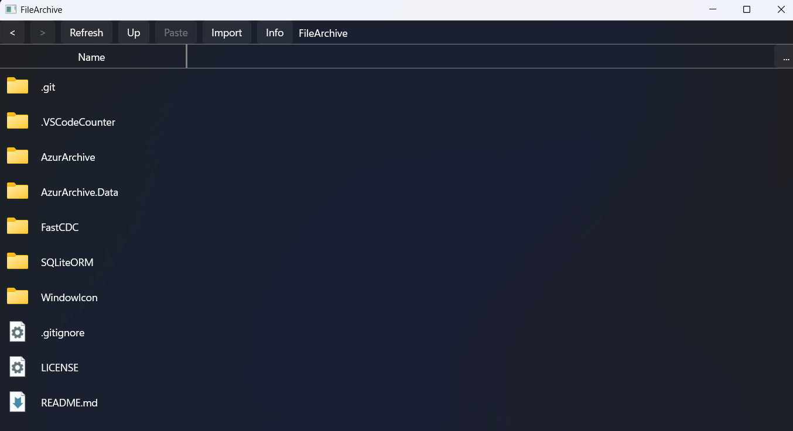
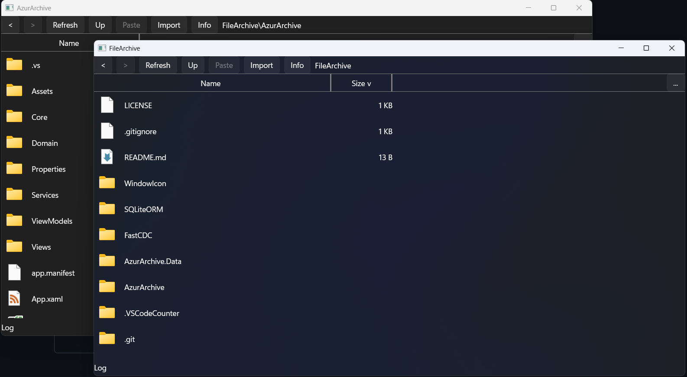
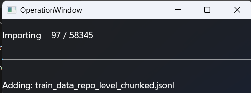
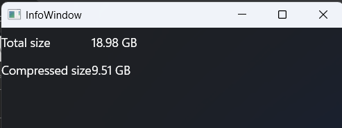

# FileArchive

> **Beta software — use with caution.** Import and export correctness is not yet guaranteed. Keep the original copies of important data and do not rely on this application as your only backup.

FileArchive is a Windows desktop application for building an incremental, compressed archive of files and folders. It provides a familiar File Explorer-style interface, while storing file data as deduplicated, compressed content-defined chunks.



## Highlights

- **Incremental compression** — chunks already present in the archive are reused instead of being stored again.
- **Import and export** folders or individual files.
- **Explorer-style archive management** — browse, copy, cut, paste, delete, rename, and open items.
- **Multiple windows** — open folders in separate Explorer windows.
- **Archive statistics** — view original and compressed sizes.
- **Multi-thread support** during archive import and export.



## How it works

```text
Folder
  -> scan files
  -> split each file with FastCDC content-defined chunking
  -> hash each chunk with BLAKE3
  -> reuse an existing matching chunk, or compress a new chunk with Zstandard
  -> store metadata in SQLite and chunk content across SQLite shards
```

Content-defined chunking makes deduplication resilient to changes in file boundaries. When files are added incrementally, shared content can reuse the same stored chunks. Therefore, importing files one at a time, in batches, or in a different order should not change the archive's deduplication result.

The current chunking configuration uses 1 KiB minimum, 32 KiB target, and 64 KiB maximum chunk sizes. Chunk content is distributed across eight SQLite shard databases, while archive metadata is stored separately.



## User interface

The main window is designed around Windows File Explorer conventions:

- Navigate backward, forward, and up through the archived folder tree.
- Import folders into the current location.
- Export a selected file or folder back to the filesystem.
- Use the context menu to open, open in a new window, rename, copy, cut, paste, or delete items.
- Customize visible columns, including original size and compressed size.



## Technology

- C# / .NET 10 for Windows
- WinUI 3 / Windows App SDK
- FastCDC for content-defined chunking
- BLAKE3 for chunk hashing
- Zstandard (`ZstdNet`) for compression
- SQLite-based metadata and sharded chunk storage

## Build from source

### Prerequisites

- Windows 10 version 1809 (build 17763) or later
- .NET 10 SDK
- A compatible Visual Studio installation for WinUI development, or the .NET CLI

Open the projects in Visual Studio and build them in dependency order:

1. Build the reusable class libraries: `FastCDC`, `SQLiteORM`, and `WindowIcon`.
2. Build `AzurArchive.Data`.
3. Build the main WinUI application: `AzurArchive`.

The `Lib/` folder includes the latest pre-built NuGet packages for these dependencies, including `AzurArchive.Data`. The application is configured for `x86`, `x64`, and `ARM64` Windows targets.

## Project layout

| Path | Purpose |
| --- | --- |
| `AzurArchive/` | WinUI desktop application and Explorer-like user interface |
| `AzurArchive.Data/` | Archive services, SQLite persistence, import/export, and chunk storage |
| `FastCDC/` | Content-defined chunking implementation |
| `SQLiteORM/` | SQLite object-relational mapping library |
| `WindowIcon/` | Windows file and folder icon support |
| `Lib/` | Pre-built NuGet packages for the project libraries |
| `Demo/` | Application screenshots used in this README |

## Status and data safety

FileArchive is an early beta. Its import and export paths have not yet been validated enough to guarantee that archived data can always be restored correctly. Use test data, retain independent backups, and verify exported files before deleting any original data.

## License

This project is licensed under the [MIT License](LICENSE).
